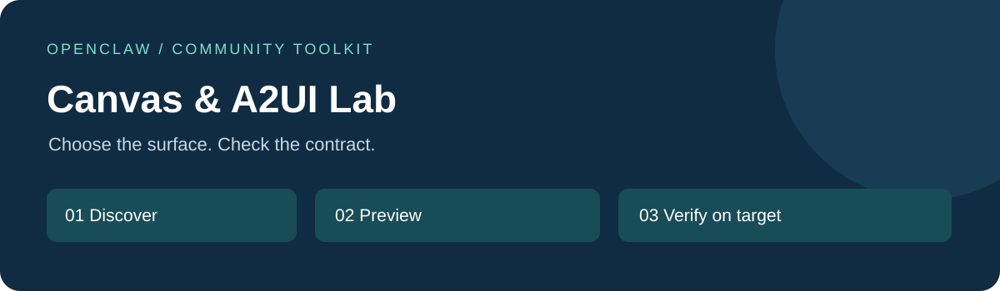

<p align="center"></p>
<p align="center"><strong>A version-aware skill, offline preflight checks, and a small working UI example.</strong><br><sub>Private review · MIT · Python 3.9+ · Not affiliated with OpenClaw</sub></p>

| First time here? | Try an artifact | Maintain / contribute |
| --- | --- | --- |
| [中文五步入门](docs/GETTING_STARTED.zh-CN.md) | [Synthetic widget example](examples/README.md) | [Developer guide](docs/DEVELOPER_GUIDE.md) |

<p align="center"></p>

## Run something now — no account or key required

```text
python scripts/validate_sequence.py examples/widget-good.json
python -m unittest discover -s tests -v
```

Expected: a preflight PASS and passing tests. Open [the local preview](examples/widget-preview.html) in a browser after downloading the repository. It displays a synthetic status card without network requests.

**The preview is HTML, not a live A2UI renderer.** The JSON files are teaching plans; this tool does not execute them against OpenClaw.

## Choose the right path

| Your installed environment | Use |
| --- | --- |
| Current widget-capable session | [HTML widget example](examples/widget-good.json) and the installed `show_widget` schema |
| Current A2UI dashboard integration | [Payload contract](references/payload-contract.md); use the installed registered-source schema |
| Older node exposing `canvas.a2ui.*` | [Legacy order-only examples](references/mode-selection.md) |
| No matching capability | Stop; do not guess commands or weaken permissions |

Upstream documentation inspected on **2026-09-02** separates dashboard A2UI from node Canvas. This repository does not claim that historical node commands work in every release. [Official node reference](https://github.com/openclaw/openclaw/blob/main/docs/nodes/index.md#macos-widget-panel).

## Install the companion skill

Review [SKILL.md](SKILL.md) first, then:

```text
openclaw skills install git:jakemorgan-research/openclaw-canvas-a2ui-skill@main
```

Private access is required. A local checkout also works with `openclaw skills install .`. For reproducibility replace `main` with a reviewed commit. Git-installed skills are refreshed by reinstalling, not by assuming registry updates apply. [Official installation guide](https://github.com/openclaw/openclaw/blob/main/docs/tools/skills.md#installing-from-clawhub).

Try asking:

> Use this skill to inspect the available Canvas/widget capabilities. Show the synthetic example only if supported, and distinguish local preflight from an observed render.

<details>
<summary><strong>What the validator does — and does not do</strong></summary>

It rejects malformed plans, unknown actions, wrong profile/mode combinations, and legacy sequences outside this lab's minimal-order convention. The current HTML profile checks required fields and rejects capability requests in the teaching plan.

It does not validate the full OpenClaw or A2UI schema, execute tools, sandbox arbitrary HTML, or prove rendering. [Exact contract](references/validation.md).
</details>

<details>
<summary><strong>Trust, privacy, and feedback</strong></summary>

All examples and diagrams are original synthetic material. No private configuration, screenshots, credentials, or device identifiers belong here. Use the built-in issue forms for reproducible problems or beginner feedback; collaborators only while private.

[Verification status](docs/VERIFICATION.md) · [Contributing](CONTRIBUTING.md) · [Security](SECURITY.md) · [License](LICENSE)
</details>
