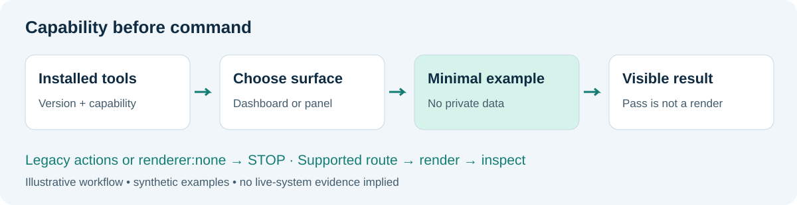
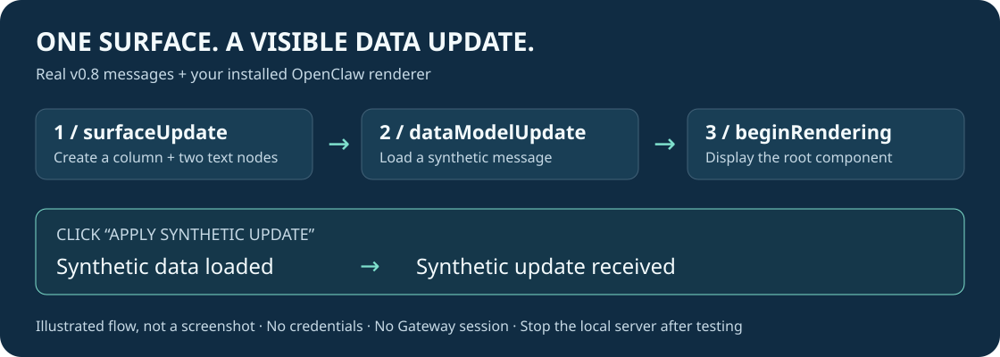

# 五步开始：先知道能用什么，再尝试展示

[返回首页](../README.md) · [开发者指南](DEVELOPER_GUIDE.md)



## 1 · 不装 OpenClaw，也能先看产物

下载仓库后双击 `examples/widget-preview.html`。你会看到一个三项检查的状态卡片。它完全离线，不需要账号、密钥或联网。

这是 HTML 外观演示，不是已经跑通的 A2UI 截图。

已有 OpenClaw？可以直接进入 [真实 A2UI 四步演示](A2UI_DEMO.md)。它使用你已安装的渲染器，显示合成卡片；点击按钮后，卡片文字会更新。无需密钥，不连接个人 Gateway。



## 2 · 跑通本地检查

需要 Python 3.9 或更新版本。在仓库目录打开终端：

```text
python scripts/validate_sequence.py examples/widget-good.json
python -m unittest discover -s tests -v
```

看到 PASS 和测试 OK，表示本地检查成功；不代表你的 OpenClaw 已经渲染。

## 3 · 分清三个词

| 名称 | 在这里的意思 |
| --- | --- |
| Widget | 在支持的会话界面展示的小组件 |
| A2UI | 需要对应渲染器和数据格式的界面描述 |
| Legacy Canvas | 旧版节点动作；仅在你的环境确实提供时使用 |

先让 Agent 查看已安装版本和可用工具，不要只凭仓库名字选择旧命令。

## 4 · 安装并做一个小尝试

先阅读 [技能说明](../SKILL.md)，再按首页的安装命令操作。私有仓库需要访问权限；不必把登录凭据告诉 Agent。

可以这样提问：

> 检查当前环境支持哪一种 Canvas 或 Widget 路径。若支持，使用仓库的合成卡片做最小展示；不要读取私人配置，不要固定到仪表盘，不要修改权限。

当前 HTML 示例把实际参数放在 `actions[0].arguments`。外层 JSON 只是本仓库的教学格式，不是 OpenClaw API。

## 5 · 看结果，再反馈

成功标准是目标界面上实际出现卡片。工具不存在、返回超时、只有本地 PASS 都不能当作展示成功。

本仓库已在 OpenClaw 2026.8.2 的隔离环境中完成技能安装与识别，并实际观察到 v0.8 渲染器显示卡片、更新绑定数据。[验收记录](ACCEPTANCE.md) 列出了已验证和未验证范围；这不等于已经跑通模型、Gateway 和所有客户端。

Issues 中选择 Beginner feedback，告诉我们卡在哪一步。只填写版本、步骤和脱敏结果，不贴完整日志或账号截图。

[完整示例说明](../examples/README.md) · [已验证与未验证范围](VERIFICATION.md)
